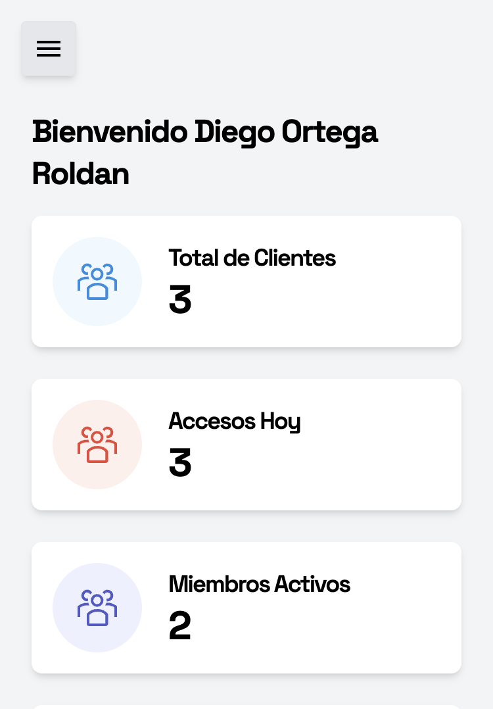

# Club Lilab App 

Bienvenido/a a este proyecto super chebre! Aquí encontrarás una configuración lista para desarrollar aplicaciones usando:

 

React (UI Library)
TypeScript (Tipado estático)
Vite (Empaquetador rápido)
Zustand (Manejo de estado sencillo y escalable)

Requisitos Previos
Node.js >= 18
(Asegúrate de tenerlo instalado en tu máquina)

.NET Core (para el backend local)

Luego de esto *IMPORANTE SI LO DESEAS PROBAR EN NETLIFY Y NO LOCALMENTE
. Desabilitar el cors de google para poder ver todo lo que tiene el proyecto.

Para iniciar sigue los pasos luego de haber levanto el proyecto de backend
# Club Lilab App 

Bienvenido/a a este proyecto super chebre! Aquí encontrarás una configuración lista para desarrollar aplicaciones usando:

React (UI Library)
TypeScript (Tipado estático)
Vite (Empaquetador rápido)
Zustand (Manejo de estado sencillo y escalable)

Requisitos Previos
Node.js >= 18
(Asegúrate de tenerlo instalado en tu máquina)

.NET Core (para el backend local)

Luego de esto *IMPORANTE SI LO DESEAS PROBAR EN NETLIFY Y NO LOCALMENTE
. Desabilitar el cors de google para poder ver todo lo que tiene el proyecto.

Para iniciar sigue los pasos luego de haber levanto el proyecto de backend

## Pasos para el proyecto

1. Consumir el api de administrador para poder iniciar con el proyecto desde el backend /api/user/register-admin

 

2. Consumir el api para verificar el correo desde el backend /api/user/verify-email

 

3. Luego dirigete a la pagina de Club Lilab app

 

4. Luego inicia sesión con el usuario administrador con el que te registraste

 

## Modulos del Proyecto

Modulo de dashboard, aqui podrás ver el total de clientes , los accesos y los miembros activos.

 

Modulo de clientes, aqui podrás filtrar, eliminar, editar y aceptar las entradas de los visitantes y miembros activos.

 

Modulo de accesos, aqui podrás filtrar las entradas de los visitantes y miembros activos.

 

Modulo de roles, aqui podrás administrar quien puede tener acceso al rol de staff o admin, aunque el sistema solo permite un administrador

 

## Resposivo

 